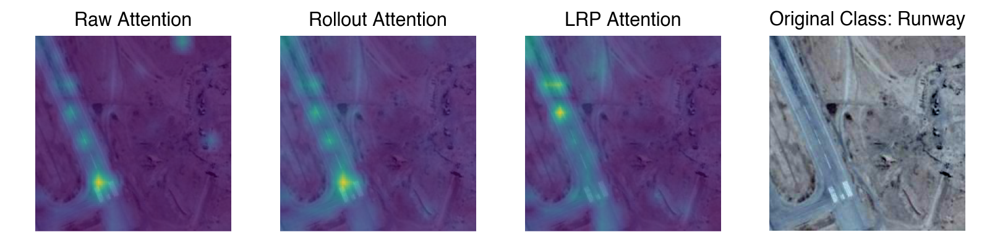
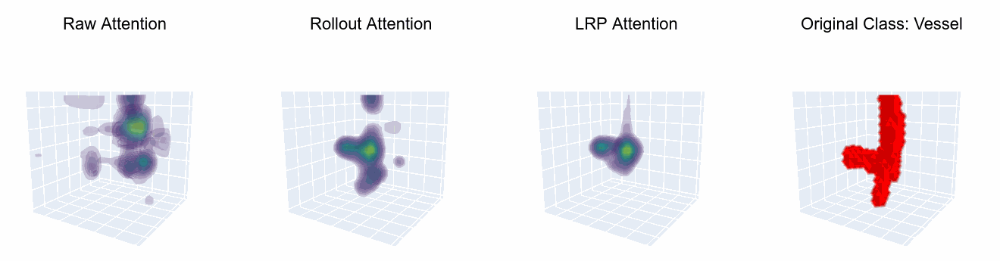
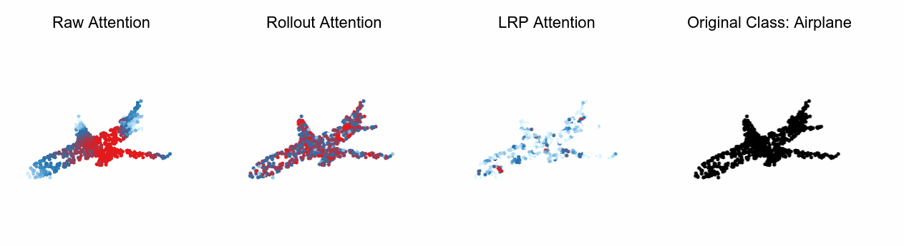

<br />
<p align="center">
  <a href=" ">
     
  </a>

  <h1 align="center">Large-scale Attribution & Attention Evaluation in Computer Vision</h1>

  <p align="center">
    <a href=""><strong>Read the paper »</strong></a>
    <br />

  </p>
</p>

> *Explainable AI (XAI) is a rapidly growing domain with a myriad of methods as well as metrics aiming to evaluate their efficacy. However, current literature is often of limited scope, examining only a handful of XAI methods and employing one or a few metrics. Furthermore, pivotal factors for performance, such as the underlying architecture or the nature of input data, remain largely unexplored. This lack of comprehensive analysis hinders the ability to make generalized and robust conclusions about XAI performance, which is crucial for directing scientific progress but also for trustworthy real-world application of XAI. In response, we introduce LATEC, a large-scale benchmark that critically evaluates 17 prominent XAI methods using 20 distinct metrics. Our benchmark systematically incorporates vital elements like varied architectures and diverse input types, resulting in 7,560 examined combinations. Using this benchmark, we derive empirically grounded insights into areas of current debate, such as the impact of Transformer architectures and a comparative analysis of traditional attribution methods against novel attention mechanisms. To further solidify LATEC's position as a pivotal resource for future XAI research, all auxiliary data—from trained model weights to over 326k saliency maps and 378k metric scores—are made publicly available.*

<br>
<p align="center">
     <br>
     <br>
    
</p>


## 📝&nbsp;&nbsp;Citing This Work

If you use LATEC please cite our [paper]()

```bibtex
@inproceedings{}
```

## 🧭&nbsp;&nbsp;Table of Contents
* [Installation](#Installation)
* [Project Structure](#project-structure)
* [Usage](#usage)
  * [Reproduce the Results](#reproduce-the-results)
  * [Run your own Experiments](#run-your-own-experiments)
* [Acknowledgements](#acknowledgements)

## ⚙️&nbsp;&nbsp;Installation

All essential libraries for the execution of the code are provided in the `requirements.txt` file from which a new environment can be created (Linux only). Setup package in a conda environment:

```
git clone https://github.com/link/to/repository
cd LATEC
conda create -n LATEC python=3.9
source activate LATEC
pip install -r requirements.txt
````
Depending on your GPU, change the torch and torchvision version in the `requirements.txt` file to the respective CUDA supporting version.

## 🗃&nbsp;&nbsp;Project Structure


```
├── configs                   - Hydra config files
│   ├── callbacks
│   ├── data
│   ├── eval_method
│   ├── experiment
│   ├── explain_method
│   ├── extras
│   ├── hydra
│   ├── logger
│   └── paths                 
├── data                      - Data storage and ouput folders
│   ├── datasets              - Datasets for all modalities
│   ├── evaluation            - Evaluation scores as .npz
│   ├── explanation_maps      - Saliency maps output as .npz
│   ├── figures               - Output of figures and gifs
│   └── model_weights         - Model weights as .ckpt files
├── logs                      - Log files             
├── notebooks                 - Notebooks for visualizations
├── scripts                   - Bash scripts for multi-runs
├── src                       
│   ├── data                  - Datamodules scripts
│   ├── modules               
│   │   ├── components        - Various submodules
│   │   ├── eval_methods.py   - Loads evaluation metrics
│   │   ├── models.py         - Loads deep learning models
│   │   └── xai_methods.py    - Loads XAI methods
│   └── utils                 - Various utility scripts
├── main_eval.py              - Runs evaluation pipeline
├── main_explain.py           - Runs explanation pipeline
└── main_rank.py              - Runs ranking pipeline
```

## 📊&nbsp;&nbsp;Usage

## 📣&nbsp;&nbsp;Acknowledgements
